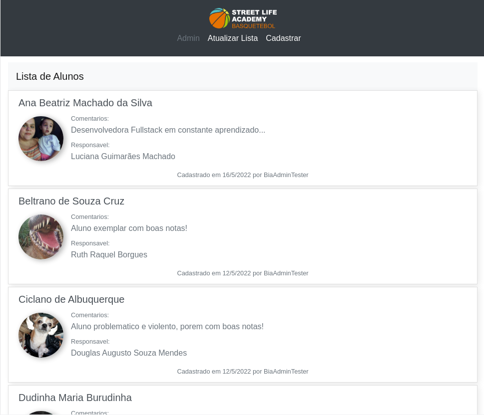

# SLAB-Lisboa
Sistema de Gestão da Street Life Academy

Este é um Sitema de Gestao integrada baseada em Django.

### Captura de tela

- URL do site Fake: [Sistema de Gestão da Street Life Academy **Fake**](http://ec2-34-203-28-207.compute-1.amazonaws.com:8000/)

- Marcação HTML5 semântica
- Propriedades personalizadas de CSS
- Bootstrap
- Django
- Python

## Autor

- Nome - [Ana Beatriz Machado](https://www.linkedin.com/in/ana-beatriz-machado-dev)
- Mentor de frontend - [@BeatrizUser](https://www.frontendmentor.io/profile/BeatrizUser)
- LinkedIn - (https://www.linkedin.com/in/ana-beatriz-machado-dev)

## Agradecimentos

Pedro, devo tudo a voçe, cara!

1# make migrate
2# manage.py runserver